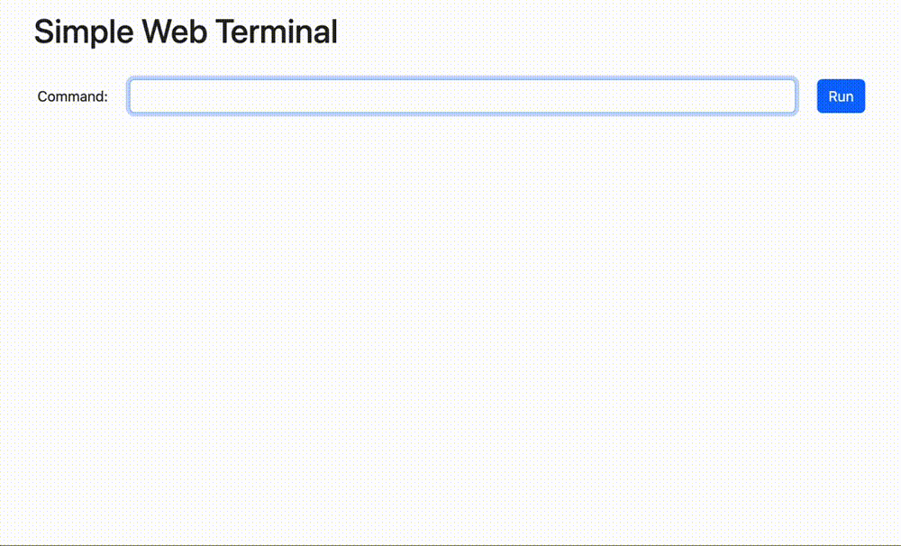

<div align="center">
  
</div>

# [Reface 🎭](https://reface.deno.dev/)

[](https://jsr.io/@vseplet/reface)
[](https://jsr.io/@vseplet/reface)
[](https://discord.gg/gT4gvVwqb8)

Легкий и типизированный шаблонизатор для создания HTML с поддержкой компонентов, стилей и скриптов.

## Основные возможности

- Template literals для создания HTML
- Компонентный подход
- Встроенная поддержка стилей
- Встроенная поддержка скриптов
- Полная типизация TypeScript
- Нет зависимостей
- Поддержка SSR

<div align="center">
  
  <p><em>Simple Web Terminal Example</em></p>
</div>

## Quick Start

```bash
# Using Deno
import { Reface } from "jsr:@vseplet/reface"
```

## Example

```tsx
import { Reface, clean, component, island, RESPONSE } from "@vseplet/reface";
import { styled } from "@vseplet/reface/styled";

// Create styled component
const Button = styled.button`
  & {
    background: var(--primary-color, #3182ce);
    color: white;
    padding: 0.5rem 1rem;
    border: none;
    border-radius: 4px;
  }
`;

// Create interactive island
const Counter = island<{ increment: null }, { count: number }>({
  template: ({ props, rpc }) => (
    <div class="counter">
      <span id="count">{props.count}</span>
      <Button {...rpc.hx.increment()}>+1</Button>
    </div>
  ),
  rpc: {
    increment: async ({ args }) => {
      const newCount = args.count + 1;
      return RESPONSE(<span>{newCount}</span>);
    },
  },
});

// Create page component
const HomePage = component(() => (
  <div class="container">
    <h1>Welcome to Reface</h1>
    <Counter count={0} />
  </div>
));

// Setup application
const app = new Reface({
  layout: clean({
    htmx: true,
    bootstrap: true,
  }),
}).page("/", HomePage);

// Start server
Deno.serve(app.fetch);
```

## More Examples

- [📚 Documentation Site](./examples/docs-viewer) - Documentation with markdown support
- [✅ Todo App](./examples/todo) - Classic todo application
- [💬 Chat App](./examples/chat) - Real-time chat application
- [📝 Blog](./examples/blog) - Blog with SSR and islands

## Documentation

Check out our [documentation](./docs/readme.md) for detailed guides and API reference.

## Contributing

We welcome contributions! Please see our [contributing guide](./CONTRIBUTING.md) for details.

## License

MIT © [Reface](./LICENSE)
